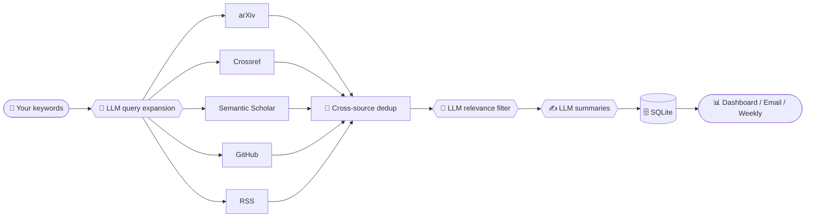

<div align="center">

🌐 [简体中文](./README.md) ｜ **English**

# 📚🔭 auto-paper-collecter

### *Your Personal Research Radar*

Every morning, let AI sweep arXiv for you and bring the latest, most relevant papers to your door ☕✨

<br>


<br>
<sub>If it saves you time scrolling arXiv, a ⭐ would mean a lot to the author!</sub>

</div>

---

## 🆕 What's New

> **2026-06-26 · Added an Agent Skill version** 🤖
>
> Besides the web app, the repo now ships a **Claude Code / Codex–compatible Agent Skill** ([`skill/`](skill/)).
> Just say **"run my paper radar"** and it runs the whole pipeline and produces today's digest ——
> **pure Python stdlib, zero dependencies, no AI API key** (the model running the skill does the query
> expansion / relevance filtering / summaries / hot-topics itself).
> 👉 See the **"🤖 Use as an Agent Skill"** section below and [`skill/SKILL.md`](skill/SKILL.md).

---

## 🌟 What is this

**auto-paper-collecter** is a lightweight, self-hosted **academic-paper aggregator**.

Tell it a few keywords you care about, and every day it automatically:

> 🛰️ Searches across **arXiv / Crossref (incl. IEEE·ACM) / Semantic Scholar / GitHub / RSS**
> 🧠 Uses an **LLM for "associative" query expansion** — not just literal keyword matching
> 🎯 Uses an **LLM to filter out off-domain / irrelevant papers** — keeping only on-topic CS work
> ✍️ Writes a **summary** for each (one-line TL;DR / method / key contributions)
> 📊 Analyzes **hot topics**, generates **weekly reports**, and **emails / browser-notifies** you

A zero-build single-page dashboard, same-origin front + back, ready out of the box.

> Note: the dashboard UI and built-in summaries default to Chinese — adapt the prompts/templates for other languages.

---

## 🎯 Motivation

> [!NOTE]
> One of the most tiring parts of research is **keeping up with the literature**.
> arXiv adds hundreds of papers a day; keyword search either misses synonymous phrasings or drowns you
> in cross-domain noise. Doing it by hand is slow and easy to miss things.

So this little tool **automates** "reading the latest papers every day", and hands the two dirtiest jobs to an LLM:

1. **Think broader**: `C2Rust` should also match `C-to-Rust translation`, `migrating legacy C code to Rust`…
2. **Filter sharper**: keep out same-name cross-domain noise like *translation* in medicine or *AI* in finance.

So when you open the page, you see **a clean, time-sorted, summarized daily feed**. 🫧

---

## ✨ Features

| | Feature | Description |
|:--:|---|---|
| 📰 | **Daily feed** | Multi-source aggregation sorted by real publication date; smart backfill when nothing is new; live top-bar search |
| 🧠 | **LLM-smart fetching** | Keyword associative expansion + CS-domain relevance filtering — broader recall, less noise |
| 🔥 | **Hot topics** | LLM clusters into mainstream sub-fields, counts the last 7/30 days, Top 3 get a **detailed summary** + their papers |
| ⭐ | **Library & notes** | One-click save, take notes, copy **BibTeX** |
| 🗞️ | **Weekly report** | Weekly picks + per-direction recap, auto-archived |
| 🔔 | **Notifications** | Browser notifications + optional **SMTP email digest** (scheduled) |
| 🛰️ | **Live GitHub source** | Also tracks the latest topic-relevant repos / paper code |
| 🌏 | **Localization** | Chinese-friendly UI & summaries, configurable timezone |

---

## 🧩 How it works



<div align="center"><sub>Deterministic steps in plain Python; the "judgement" goes to the LLM — fast and accurate.</sub></div>

---

## 🚀 Quick Start

```bash
# 1) Clone & enter
git clone https://github.com/PenghaoJiang/auto-paper-collecter.git
cd auto-paper-collecter

# 2) venv & deps
python -m venv .venv
source .venv/bin/activate            # Windows: .venv\Scripts\activate
pip install -r requirements.txt

# 3) Configure (copy the template, then edit .env with your AI gateway etc.)
cp .env.example .env

# 4) Take off 🛫
python run.py
```

Open **http://localhost:8000** → go to "Settings" to add keywords → click "Save & Fetch".

> [!TIP]
> Use **English** keywords (higher recall across sources). The first fetch + summaries take ~1–3 min in the background; the page updates automatically when done.

---

## 🤖 Use as an Agent Skill

Besides the web app, the repo ships a **Claude Code / Codex–compatible Agent Skill** (the [`skill/`](skill/) directory) —
just tell your AI assistant **"run my paper radar"** and it runs the whole pipeline and produces today's digest,
with **no AI API key needed** (the model running the skill *is* the LLM).

```bash
# Install: copy skill/ into your Claude Code skills directory
cp -r skill ~/.claude/skills/auto-paper-collecter
# Edit your keywords
$EDITOR ~/.claude/skills/auto-paper-collecter/state/config.json
```

Then tell Claude Code **"run my paper radar / what's new today"**. The scripts are **pure Python stdlib, zero-dep**;
deterministic fetching is done by the scripts, while the LLM judgement (expansion / relevance filter / summaries /
hot-topics) is done by the model running the skill (Claude Code → Claude; Codex → GPT). See [`skill/SKILL.md`](skill/SKILL.md).

---

## ⚙️ Configuration

Everything lives in `.env` (see `.env.example`):

| Variable | Required | Description |
|---|:--:|---|
| `AI_BASE_URL` / `AI_API_KEY` / `AI_MODEL` | ✅ | Any **OpenAI-compatible** gateway. With `AI_ENABLED=false` it falls back to raw summaries and skips the LLM |
| `SEMANTIC_SCHOLAR_KEY` | ⬜ | Optional; works without one, just stricter rate limits |
| `GITHUB_TOKEN` | ⬜ | Optional; raises the GitHub search rate limit |
| `SMTP_*` / `EMAIL_*` | ⬜ | Optional; the scheduler emails the daily digest (Gmail needs an **App Password**) |
| `REFRESH_TIMES` / `TIMEZONE` | ⬜ | Daily refresh times & timezone (default `10:00,22:00` / `Asia/Shanghai`) |
| `BACKFILL_N` / `RSS_FEEDS` | ⬜ | Backfill count / academic-news RSS feeds |

> [!IMPORTANT]
> `.env` is gitignored — **your keys are never committed**. Keep them safe 🔐

---

## 🛰️ Data Sources

| Source | Content | Notes |
|---|---|---|
| **arXiv** | Preprints (official API) | The CS workhorse |
| **Crossref** | Journal/conference metadata | Incl. IEEE·ACM; metadata + abstract only |
| **Semantic Scholar** | General scholarly search | Built-in TLDR; constrained to CS |
| **GitHub** | Live repos / paper code | A supplementary signal |
| **RSS** | Academic news / blogs | Custom feeds supported |

---

## 📡 API

<details>
<summary>Click to expand all endpoints</summary>

| Method | Path | Description |
|---|---|---|
| `GET`  | `/api/bootstrap` | Everything the dashboard needs in one shot (feed / library / trends / weekly / settings) |
| `POST` | `/api/refresh` | Trigger a background fetch (returns immediately; front-end polls `refreshing`) |
| `GET`  | `/api/trends?domain=&window=7` | Hot topics (Top 3 + per-direction deltas + papers) |
| `GET`  | `/api/report/weekly` | Generate / get the latest weekly report |
| `POST` | `/api/library/{paper_id}` | `{saved, read, note}` save / read / note |
| `GET·PUT` | `/api/settings` | Keywords / sources / times / backfill N / push / email |
| `POST` | `/api/test-email` | Send a test email to verify SMTP |

</details>

---

## 🗺️ Roadmap

- [x] Multi-source aggregation + LLM expansion + relevance filter
- [x] Hot topics (sub-fields + detailed summaries + paper lists)
- [x] Library / notes / BibTeX / weekly report
- [x] Browser + email push, scheduled jobs
- [ ] More sources (OpenReview / bioRxiv …)
- [ ] Multi-user + auth (PostgreSQL)
- [ ] One-click Docker deploy
- [ ] Mobile-friendly layout

> Request features in [Issues](../../issues)! 🙌

---

## 🤝 Contributing

This is a **side-project polished in spare time**, and it grows with your help — **contributions of any kind are very welcome!** 🌱✨

- 🐛 **Found a bug** → open an [Issue](../../issues)
- 💡 **Have an idea / want to chat** → brainstorm in [Discussions](../../discussions) 🧠
- ✨ **Want a feature** → make a wish in [Issues](../../issues)
- 🔧 **Want to build** → Fork → change → open a **Pull Request**

Whether it's fixing a typo, improving a doc, or adding a new source — **every contribution counts** 💗
You're also welcome to just drop by [Discussions](../../discussions) to share your research workflow and keyword setups — let's grow this little radar together 🚀

---

<div align="center">

### ⭐ If you find it useful, please drop a Star!

<sub>Every Star keeps the author motivated 🌱</sub>

<sub>Ideas, questions, or want to co-build? Come hang out in <a href="../../discussions">💬 Discussions</a>!</sub>

<br><br>

**📚 Read less, know more. Let the radar do the scanning.** 🔭

<br>

<sub>Made with ❤️ & ☕ · Licensed under <a href="./LICENSE">MIT</a></sub>

</div>
